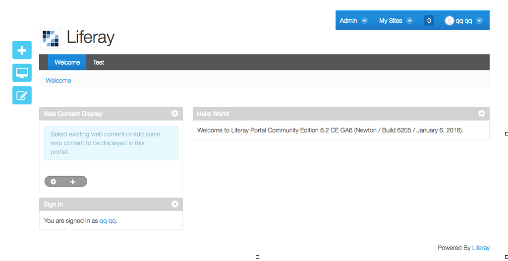
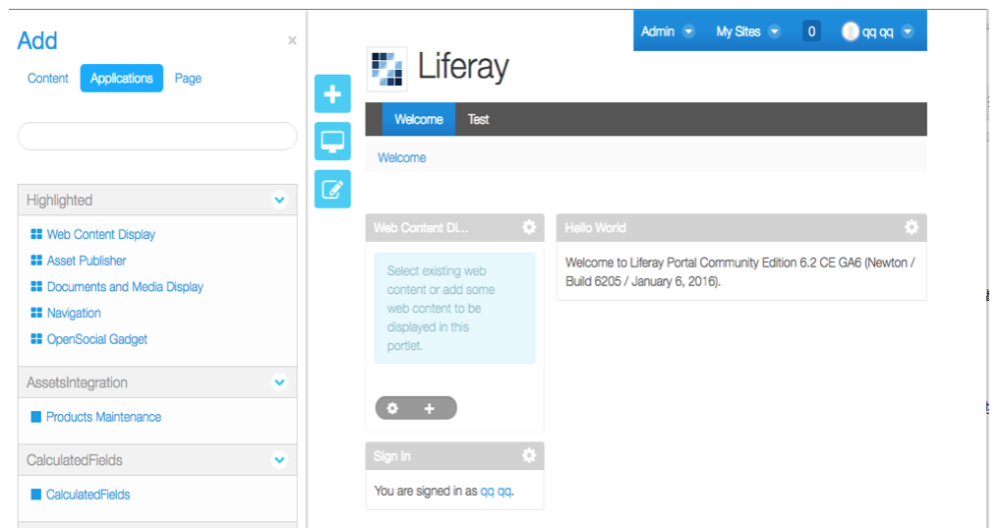
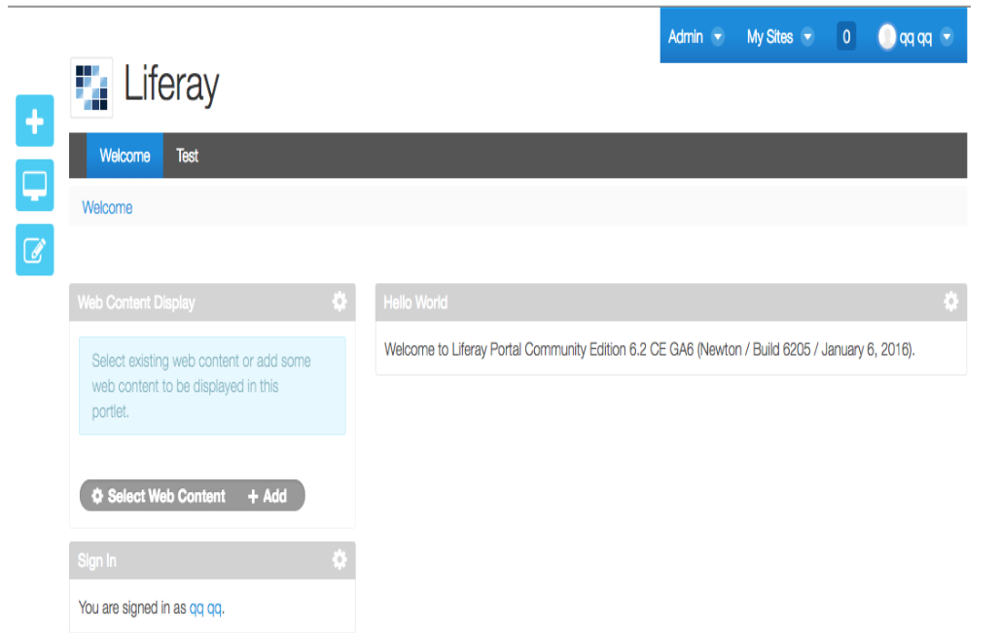
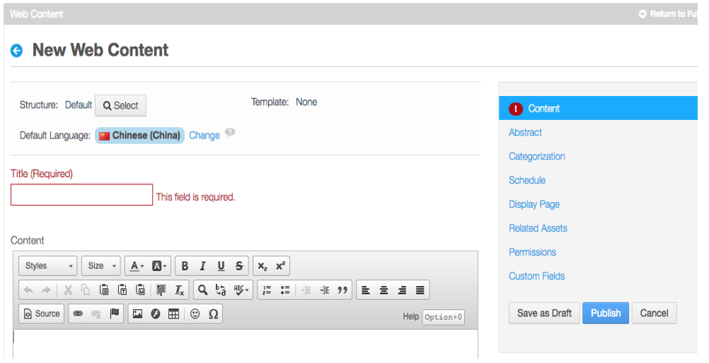
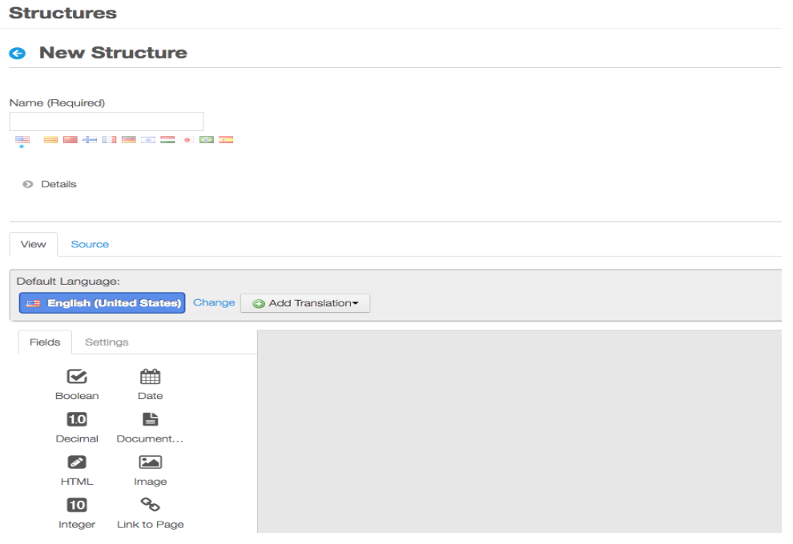
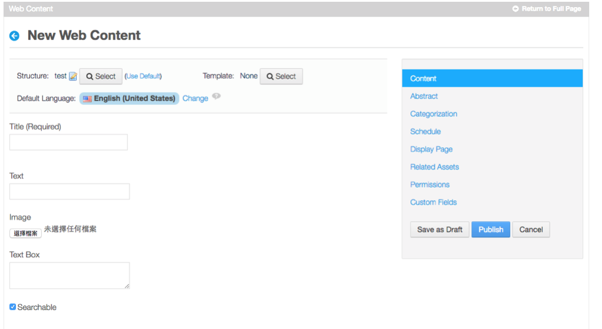
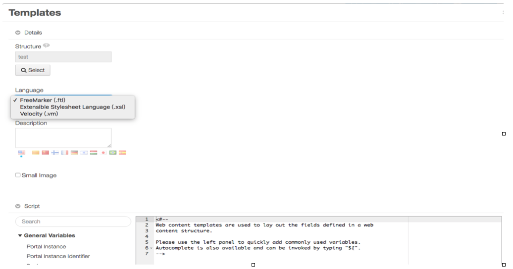
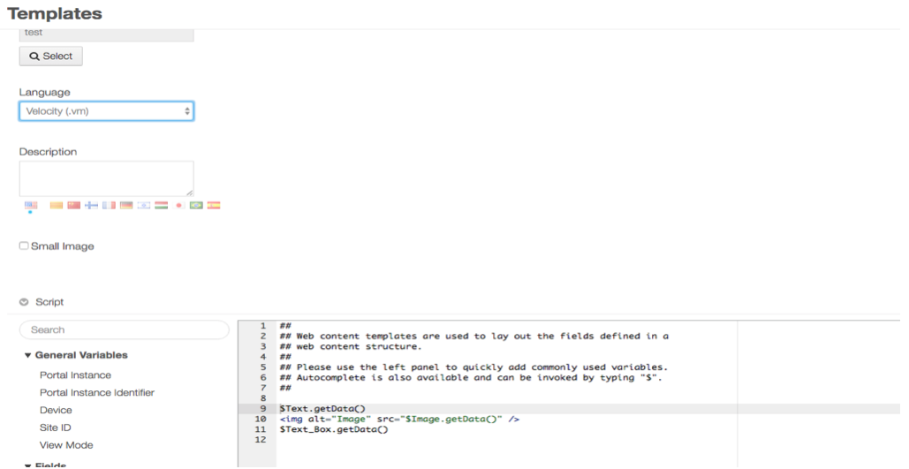
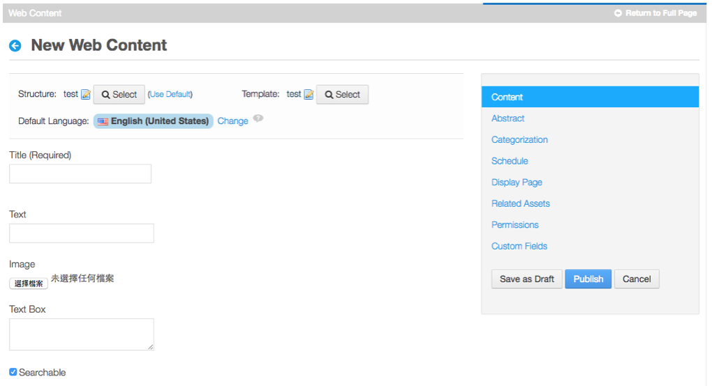
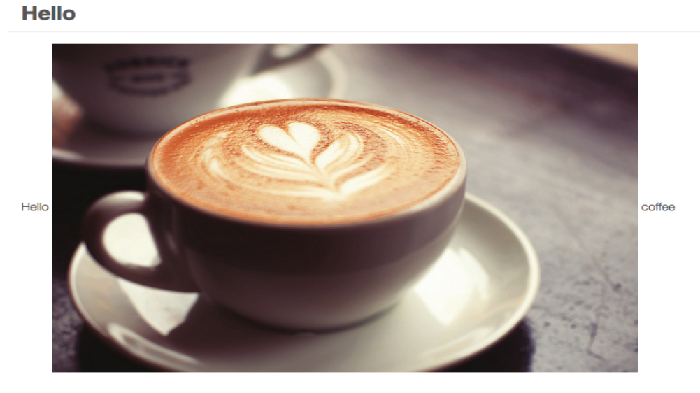

＃ Velocity 簡介

## Velocity說明
	Velocity是一個基礎Java的模板引擎(Template Engine)，是由Apache提出，Apache對Velocity對他的定義是使用簡單的模板語言(Template Language)來引用由Java代碼定義的對象。
	Velocity也是MVC架構的一種實現，而他主要是應用在Model和View之間，作為橋樑。

---

## Velocity三種引用(reference)
	變量：針對Java對象的一種字串符號表示，回傳值調用了Java的toString()方法的結果。
	方法：調用的是對象的某個方法，該方法必須是public的，回傳值也是toString()，方法的參數也必須為String的。
	屬性：除了訪問Java的類屬性外，等價於get..()方法。

---

## Velocity基本符號
	“＃” 來標示velocity的腳本語句。
	“＄” 來標示一個對象(或變量)。
	“{ }” 來標示velocity變量。
	“！”強制把不存在的變量顯示為空白。
	用雙引號還是單引號表示，默認“”，可以在stringliterals.interpolate=false改變默認處理方式。

---

## Velocity在Liferay上面的應用
	1.在Liferay畫面 點選畫面最右上方的帳戶,選擇My Dashboard後即可開始編輯自己的Liferay 頁面。

#

	2.進入編輯自己的Liferay頁面點選左上角的＋號圖示後左邊會出現一個Add的編輯頁面。
	3.選擇中間的Applcations後會出現可以添加的功能頁面，在此我們選擇Highlighted底下的Web Content Display加進網頁內。

#

	4.點選Web Content Display下方的+圖示進入Web Content Display的設定。

#

	5.在Web Content裡可以編輯你需要呈現在網頁面上的文字，圖片，功能等，在此要選擇不一樣的模板需要點選Structure旁的Select後，可以自行新增，修改。

#

	6.進入新增Structure後下方的view是可以將想使用的Fields利用滑鼠拖拉的方式放置右邊空白處，或者也可以點選Source的方式來增加程式碼。

#

	7.選擇完你需要的Fields確定後，會出現下圖的頁面，在此利用簡單的功能來說明，選擇了Text,Image,TextBox.

#

	8.做好需要的Structure後，再來需要增加Template的部分，點選Template旁的select按鈕進入後再點選+add來新增Template

#

	9.Template的部分是利用一些程式串接structure後呈現所想要的樣式(字型，顏色，大小...等)給 web page, 而在此編譯的語法有三種選擇分別是FreeMarker,Extensible Stylesheet Language, Velocity,前面所描述的Velocity的部分,也就是在這裡面做編輯應用。

#

	10.這裡利用一個簡單的語法來寫Template,寫好後儲存。

#

	11.在此即可填寫所需要的圖以及內容，填寫完後按右方的Save as Draft按鈕後為儲存你的設定，再按Publish即可把你的頁面部署在web page上面

#
